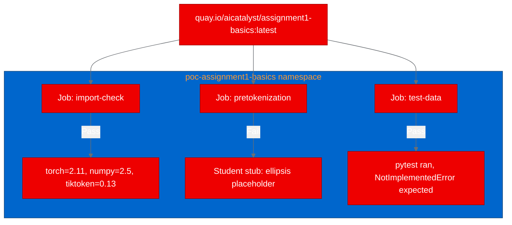

## Containerizing Stanford's CS336 ML training framework on OpenShift

Can a PyTorch-based educational ML framework, designed for local development with uv, run inside a containerized OpenShift environment? We tested this by packaging Stanford's CS336 assignment1-basics on Red Hat OpenShift using Universal Base Images (UBI) and validating that the full ML stack works correctly.

## What is CS336 assignment1-basics?

Stanford's CS336 course teaches language model construction from scratch. The assignment1-basics repository provides the scaffolding: test harnesses, fixture data, and adapter interfaces for implementing BPE tokenizers, transformer components (attention, embeddings, feed-forward networks), and training loops.

The project uses modern Python tooling: pyproject.toml with uv for reproducible builds, pytest for testing, and a real ML dependency stack including PyTorch 2.11, numpy, tiktoken, einops, and jaxtyping. It's a substantial project that exercises the same packages production ML teams use.

## Why containerize an educational framework?

Educational ML frameworks face the same packaging challenges as production code:

- Students and teaching assistants need reproducible environments across different machines
- Course infrastructure teams need to validate that assignments work in standardized compute environments
- The dependency stack (PyTorch, CUDA, numpy) is notoriously fragile across operating systems and Python versions

Containerizing on OpenShift proves that the dependency resolution works in a controlled, enterprise-grade environment, not just on a developer's laptop.

## Building the container image

We used a UBI Python 3.12 image with PyTorch installed via pip:

```dockerfile
FROM registry.access.redhat.com/ubi9/python-312

WORKDIR /opt/app-root/src

USER 0
RUN dnf install -y gcc python3-devel && dnf clean all
USER 1001

COPY . .

RUN pip install --no-cache-dir \
    torch --extra-index-url https://download.pytorch.org/whl/cpu
RUN pip install --no-cache-dir -e .

USER 0
RUN chgrp -R 0 /opt/app-root && chmod -R g=u /opt/app-root
USER 1001

ENTRYPOINT ["python"]
CMD ["-c", "import torch; print(f'torch={torch.__version__}')"]
```

One lesson: the pyproject.toml pins `torch~=2.11.0`, which overrides the CPU-only install and pulls the full CUDA version. The resulting image is about 3 GB. For production use, you'd want to either modify the version constraint or use a requirements.txt with explicit CPU-only pinning.

Another lesson: the `.dockerignore` initially excluded `README.md`, but pyproject.toml references it in the `readme` field. The build failed with a cryptic "file not found" error during metadata generation.

## Running tests as Kubernetes Jobs



We deployed three Kubernetes Jobs, each testing a different aspect:

| Scenario | Result | Details |
|---|---|---|
| Import check | Pass | PyTorch 2.11.0, numpy 2.5.1, tiktoken 0.13.0 all import correctly |
| Pretokenization | Fail | Source contains placeholder ellipsis, not runnable as-is |
| Data tests | Pass | pytest framework executed correctly with expected NotImplementedError |

The import check confirmed that the complete ML stack (PyTorch, numpy, tiktoken, einops, jaxtyping) installs and loads correctly in the UBI container. The test framework ran without import errors or setup failures, failing only at the student implementation stubs.

## Practical takeaways

**PyTorch version pinning complicates CPU-only builds.** When pyproject.toml pins `torch~=2.11.0`, pip ignores the `--extra-index-url` for CPU-only and resolves to the CUDA version. If you need CPU-only images, use a separate requirements file with explicit CPU wheel URLs.

**Large ML images need longer scheduling timeouts.** The 3 GB image caused initial Job timeouts during image pull. Set `activeDeadlineSeconds` generously and consider node-level image pre-pulling for ML workloads.

**Build metadata matters.** The `readme` field in pyproject.toml creates a hard dependency on README.md during `pip install -e .`. Don't exclude it in `.dockerignore` if you're using editable installs.

## Try it yourself

The container image is at `quay.io/aicatalyst/assignment1-basics:latest`. Verify the ML stack works:

```bash
kubectl run cs336-test \
  --image=quay.io/aicatalyst/assignment1-basics:latest \
  --restart=Never -- \
  -c "import torch; import numpy; print(f'torch={torch.__version__}, numpy={numpy.__version__}')"
kubectl logs cs336-test
```

All artifacts are in the [AutoPoC fork](https://github.com/aicatalyst-team/assignment1-basics), including the [Dockerfile](https://github.com/aicatalyst-team/assignment1-basics/blob/main/Dockerfile.ubi), [Kubernetes manifests](https://github.com/aicatalyst-team/assignment1-basics/tree/main/kubernetes/), and the full [PoC report](https://github.com/aicatalyst-team/assignment1-basics/blob/autopoc-artifacts/poc-report.md).

To learn more about running ML workloads on [Red Hat OpenShift AI](https://www.redhat.com/en/technologies/cloud-computing/openshift/openshift-ai), explore the documentation for Jupyter workbenches and training operators.
